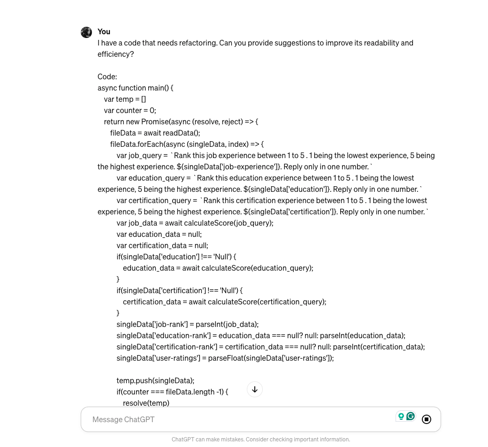
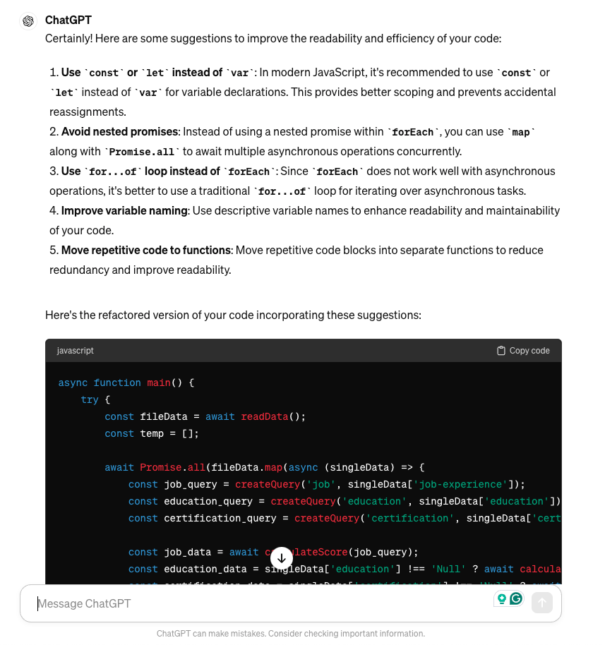

+++
date = '2025-06-10T11:56:14+05:30'
draft = false
title = '10 Chatgpt Prompts to Boost Developer Productivity'
tags = ['artificial-intelligence']
aliases = ["/blog/10-chatgpt-prompts-to-boost-developer-productivity/79/"]
+++
As developers and engineers, we constantly seek ways to streamline our workflows, increase productivity, and solve complex problems efficiently. With the advent of advanced language models like ChatGPT, we now have powerful tools to assist us in our daily tasks.

By leveraging the capabilities of ChatGPT, we can generate prompts that enhance our productivity and creativity, making us more effective problem solvers and innovators.

In this article, we'll explore 10 ChatGPT prompts tailored specifically for developers and engineers to boost their productivity and streamline their workflow.

## Code Refactoring Suggestions

Here is the sample prompt:

**"I have a code that needs refactoring. Can you provide suggestions to improve its readability and efficiency? Here is the code: <paste or write code here>"**

Use ChatGPT to generate recommendations for refactoring code snippets, such as identifying redundant lines, suggesting better variable names, or proposing alternative algorithms to optimize performance.

Please refer to the screenshot below:



Here is the response:



## Troubleshooting Assistance:

Here is the sample prompt:

```
"I'm encountering an error message \[insert error message here\] in my code. Can you help me troubleshoot and find a solution?"
```

This prompt will help you troubleshoot bugs or issues in your code. Again, there may need a couple of iterations to really nail down the problems but this is a good starting prompt.

## API Documentation Retrieval

Here is the prompt:

```
"I'm working with the \[insert API name\] API. Can you provide me with relevant documentation or usage examples?"
```

This is really helpful when we are working with new systems or platforms and instead of reading all the documentation, you can ask the ChatGPT to retrieve useful information for you in a summarized way.

## Design Pattern Recommendations

Here is the prompt:

```
"I'm designing a new software component. Here is the requirement: \[ Put your requirement here\]. What design pattern would you recommend for implementing \[insert functionality\]?"
```

This prompt requires a good level of detail but it can help you recommend some of the best design patterns you should use for your problem set.

## Algorithm Optimization Techniques

Here is the prompt:

```
"I'm implementing \[insert algorithm name\]. Are there any optimization techniques or best practices I should consider?"
```

This is not only limited to algorithms but you can use some code as well. In short, this prompt will help you optimize the algorithm/code.

## Code Review Feedback

Here is the prompt:

```
"I've written a new feature. Can you review my code and provide feedback on potential improvements? Here is the code : \[Insert code here\]"
```

ChatGPT can provide some really good feedback about your code. You may or may not implement all those feedbacks but it can certainly be a good starting point.

## Library or Framework Recommendations

Here is the prompt:

```
"I'm starting a new project. Can you recommend a suitable \[insert programming language\] library or framework for \[insert functionality\]?"
```

ChatGPT can suggest popular libraries, frameworks, and tools based on the programming language and desired functionality, enabling you to make informed technology choices.

## Technical Documentation Summaries

Here is the prompt:

```
"I need a summary of the \[insert technology or concept\] technical documentation. Can you provide a concise overview?"
```

This is my most used prompt, I summarize the technical documentation and read the gist, this has certainly improved my productivity.

## Code Snippet Generation

Here is the prompt:

```
"I need a code snippet for \[insert functionality or task\]. Can you generate a sample code snippet?"
```

This is a good prompt to generate a starter code pack. But be sure not just to copy the code and use it, be cautious with the code generated by LLMs as they contain security flaws and bugs as well.

## Project Planning and Task Prioritization

Here is the prompt:

```
"I'm planning my project roadmap. Can you suggest a prioritized list of tasks based on \[insert project requirements or constraints\]?"
```

ChatGPT can analyze project requirements, dependencies, and deadlines to generate a prioritized task list, helping you effectively manage project timelines and deliverables.

## Conclusion:

Incorporating ChatGPT prompts into your development workflow can significantly enhance productivity, creativity, and problem-solving capabilities. By leveraging ChatGPT's natural language understanding and generation capabilities, developers and engineers can streamline tasks such as code refactoring, troubleshooting, documentation retrieval, and project planning. By integrating ChatGPT into your toolkit, you empower yourself to tackle challenges more effectively and unlock new levels of innovation in your projects.
