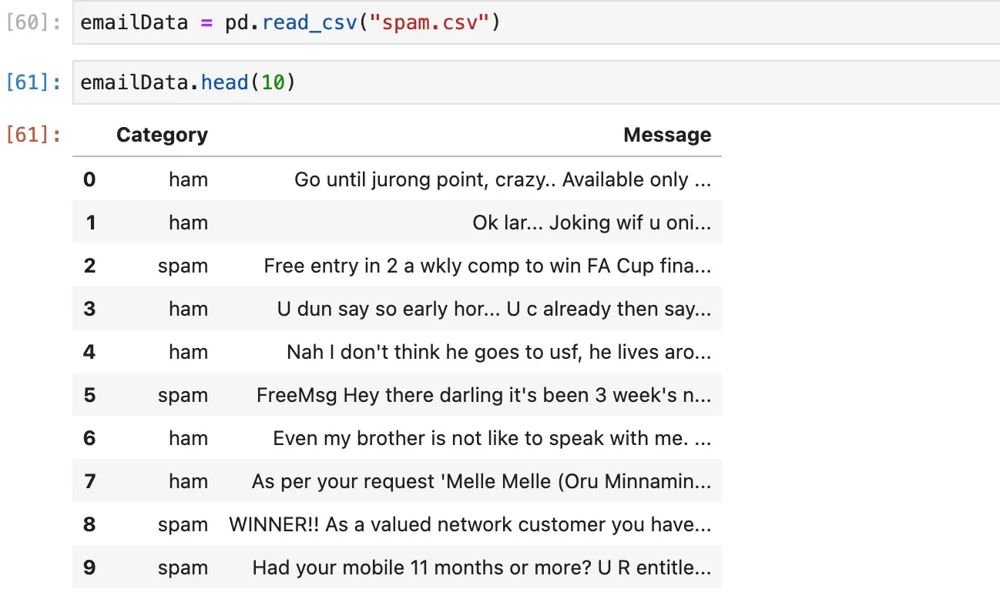

+++
date = '2023-08-18T11:56:38+05:30'
draft = false
title = 'Email Spam Detection Model Python'
tags = ['artificial-intelligence','machine-learning']
+++
I am pretty sure everyone who is reading this knows about email spam. This is a very general problem; almost all major email platforms have solved this problem to some extent. But, have you wondered how it actually works? In this article, we are going to explore the same and build and train a Machine Learning model that will detect incoming email and identify it as spam or ham.

## Prerequisites

This is going to little a lengthy tutorial so be ready with your coffee and make sure the following software is already installed on your machine:

*   Python
*   Jupyter Notebook
*   Visual Studio Code or Editor of your choice

Here are quick links to the installation page of [Python](https://www.python.org/downloads/) and [Jupyter Notebook](https://jupyter.org/install).

You should also install the **Anaconda** package that contains the majority of the libraries we need for Machine learning in Python. Click [**here**](https://www.anaconda.com/download) to go to the downloads page.

I also assume that you know the basics of Machine learning and Python because I won't be digging too deep into basic concepts.

## Problem Statement

Build and train a Machine learning model with good accuracy to detect emails as spam or ham (no spam). We should use standard libraries available for Machine learning model building.

## Dataset

To train any model, you need a pre-defined dataset that contains good and clean data. By clean I mean it should not have null values, ambiguous data or empty data. For this tutorial, I have identified a clean dataset and you can download it directly by clicking the link below.

[Spam Dataset](https://shaikhshahid.com/wp-content/uploads/2023/09/spam.csv)

## Code

Let's jump into the code. Open your Jupyter Notebook and import all the libraries we will need.
```python
    import numpy as np
    import pandas as pd
    from sklearn.model_selection  import train_test_split
    from sklearn.feature_extraction.text import CountVectorizer
    from sklearn.naive_bayes import MultinomialNB
    from sklearn import metrics
```    

Now, import the CSV you just downloaded as a pandas data frame.
```python
    emailData = pd.read_csv("spam.csv")
    emailData.head(10)
```    

You should have the file data in your notebook similar to this.



Analyze the data and ensure there are no null values using the following code.
```
    emailData.shape
    emailData.isnull().sum()
    emailData.describe()
```
Our target variable in the dataset is the Category and we should convert it into a numerical variable for the model. Here we will map it this way
```
Spam -> 1

Ham -> 0
```
Here is the code.
```python
    emailData['Spam'] = emailData.Category.map({"spam":1, "ham":0})
    emailData.drop("Category",axis=1,inplace=True)
```
Now our data is clean and ready to be used in the model building.

Now our target variable is Spam which will determine whether the e-mail is spam or ham. First, will define X and Y variables.
```
    X = emailData.Message
    y = emailData.Spam
```
X is our input which is email messages in the data file and y is our target variable.

Next, we will split our data in a 70-30 split. 70% of the data will be used for training our model and 30% of it will be used for testing purposes. It's not a set practice and some engineers choose 75-25 split which is also fine.
```
    X_train,X_test,y_train,y_test = train_test_split(X,y,random_state=1,test_size=0.3)
```
The **random state** ensures that every time we run the code it will produce the same test and train split.

Now comes the important part, we need to convert the email and the words in those emails as tokens and we also need to avoid stop words to not create confusion. Let's create that using the **CountVectorizer** package.
```
    vect = CountVectorizer(stop_words='english')
    vect.fit(X_train)
```
Let's transform them into a numerical format for the model to understand better.
```
    X_train_transformed = vect.transform(X_train)
    X_test_transformed = vect.transform(X_test)
```
Let's build a model. We will be building a multinominal Naive Bayes Model which is widely used for text-based prediction.
```
    mnb = MultinomialNB()
    mnb.fit(X_train_transformed,y_train)
```
Now, that our model is instantiated, let's test it with our test data.
```
    y_pred = mnb.predict(X_test_transformed)
```
Let's check the accuracy score.
```
    metrics.accuracy_score(y_pred, y_test)
```
For me, it's coming around **0.9856459330143541 i.e** 98% accuracy.

## Testing the Model with Real Data

Time to test our model with some real data. I copied the following e-mail from my Gmail Inbox to see how it detects spam and ham.
```
    emails=[
        'Sounds great! Are you home now?',
        'Will u meet ur dream partner soon? Is ur career off 2 a flyng start? 2 find out free, txt HORO followed by ur star sign, e. g. HORO ARIES',
        'Hello My Name is Gabriel Robert a top Bank Officer with Standard Bank of South Africa and I am in need of a reliable foreigner to carry out this important deal. An account was opened in my bank by one of my customers a Dutch National from Germany who made a fixed deposit of $11,100,000.00 (Eleven Million, One hundred Thousand United States Dollars) and never show up again and I later discovered that he died with his entire family members on a plane crash that occurred in Libya on the 12th of May 2010 which I can give you a link to that crash if you care. Since nobody is coming for this fund or knows about this fund I want to present a foreigner like you as next of kin to my late client so we can make the claim and you can contact me if you are interested so I can give you more detailed information about this transaction. For the sharing of the money will be shared in the ratio of 50% for me, 40% for you and 10% to cover our expenses after the deal. Now the total amount to be transferred is $12.2 million because of the interest the fund has accumulated for some recent time. Please keep this absolutely confidential and tell me if you are interested but I can assure you 100% risk free as I know how to go about it. Waiting for your urgent reply and call. Thanks.'
    ]
```
Here is the code to predict this with our model.
```
    email_1 = vect.transform(emails)
    mnb.predict(email_1)
```
Should give us the following output.
```
    array([0, 1, 1])
```
Here 0 means ham and 1 means spam. So in my case, it is correct and detected the spam correctly. Do a test with your own e-mail data from your inbox and see how it's reacting to your data.
