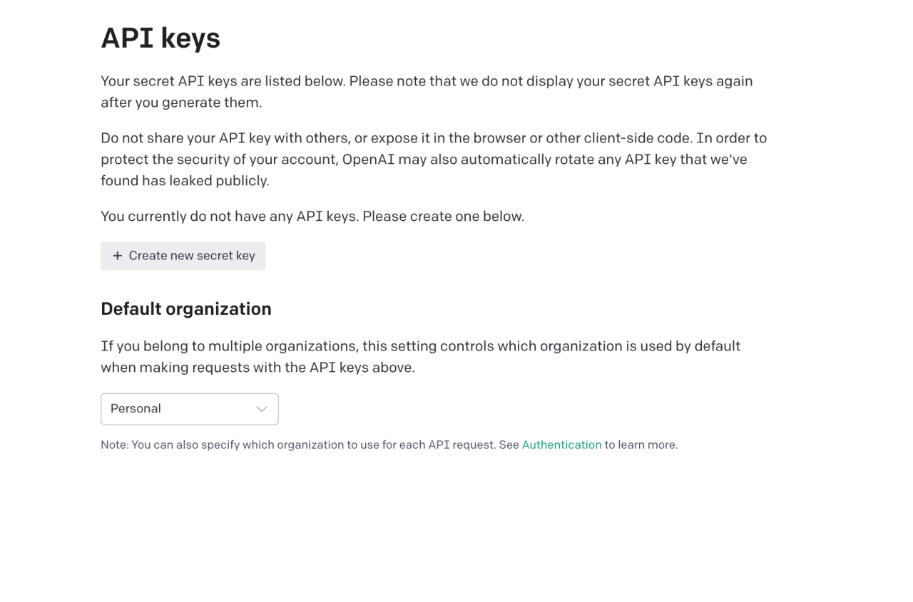
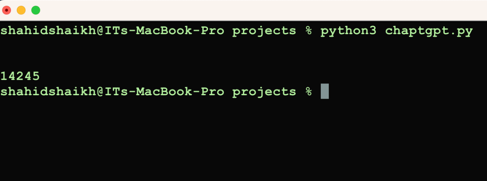

+++
date = '2022-12-31T11:58:04+05:30'
draft = false
title = 'Getting Started With Chatgpt'
tags = ["artificial-intelligence", "gpt"]
aliases = ["/blog/getting-started-with-chatgpt/31/"]
+++
OpenAI developed ChatGPT specifically for chatbot applications. Its underlying architecture, the GPT (Generative Pre-training Transformer), has a proven track record of excellence in a range of natural language processing applications.

One of ChatGPT's main features is its ability to generate text input responses that resemble human responses. Because it has been trained on a huge dataset of interactions, it can understand the context and flow of a discussion and offer appropriate responses.

In addition to providing responses, ChatGPT is also equipped to translate, summarise, and classify text, among many other tasks. because it is adaptable.

Other activities that can be accomplished with ChatGPT include text classification, translation, and summarization. This makes it a versatile technology that can be used for many different chatbot applications.

Adopting ChatGPT has the benefit of being easily incorporated into chatbot platforms that are currently in use, such as Slack or Facebook Messenger. Developers may now make chatbots that converse with users in a natural and engaging manner as a consequence.

Here is a guide that will walk you through the process of setting up ChatGPT to build a chatbot.

## Step 1: Set up a development environment

To use ChatGPT, you will need to have the following software installed on your computer:

- Python 3.6 or later
- The `openai` Python package

You can install the `openai` package using pip:

```pip install openai```

## Step 2: Import ChatGPT

To use ChatGPT in your Python code, you will need to import it from the `openai` package:

```
import openai
```
## Step 3: Set your API key

To use ChatGPT, you will need to have an API key. You can [sign up](https://openai.com/) for an API key at the OpenAI website.



Once you have your API key, you can set it using the following code:

```
openai.api_key = "YOUR_API_KEY"
```    
Replace `YOUR_API_KEY` with your actual API key.

## Step 4: Use ChatGPT to generate responses

To use ChatGPT to generate a response to a given input, you can use the `openai.Completion.create` function. This function takes the following arguments:

- `engine`: The name of the ChatGPT model you want to use.
- `prompt`: The input text you want to generate a response for.
- `max_tokens`: The maximum number of tokens (words or word pieces) that the response should contain.

Here is an example of how you might use the `openai.Completion.create` function to generate a response:
```javascript
    import openai
    
    openai.api_key = "PUT OPENAI API KEY"
    
    response = openai.Completion.create(
        engine="text-davinci-002",
        prompt="Whats 2+12223",
        max_tokens=64
    )
    
    response_text = response['choices'][0]['text']
    print(response_text)
```     

Run the code using the following command.

```
python filename.py
```

You should receive the following output in the terminal.



This code will generate a response to the input text "Hello, how are you today?", using the ChatGPT model named "text-davinci-002". The response will be limited to 64 tokens. The response text will be printed on the console.

## SUMMARY

Once you have the primary usage of ChatGPT working, you can use it to build a chatbot. There are many different ways you can do this, depending on your specific needs and requirements. Here are a few ideas to get you started:

- Use ChatGPT to generate responses to user input in real time. You can use a library  `websockets` to handle real-time communication with the user.
- Use ChatGPT to pre-generate a set of responses that your chatbot can use to respond to user input. This can be a good option if you want to build a chatbot that can respond to a large number of different inputs.
- Use ChatGPT to generate responses to user input in combination with other AI technologies, such as natural language processing or machine learning. This can allow you to build a chatbot to understand more complex user input and perform more advanced tasks.

I hope this tutorial has given you a good overview of how you can use ChatGPT to build a chatbot. With a little bit of creativity and some
