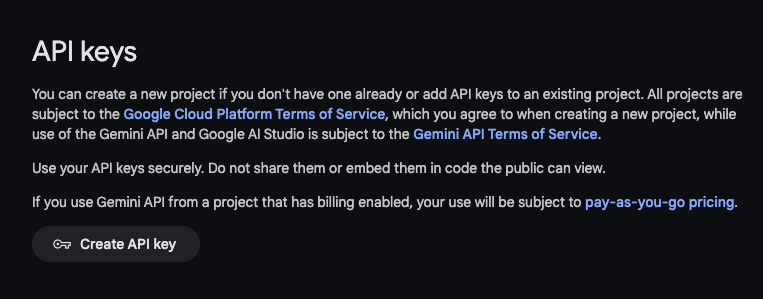

+++
date = '2024-05-21T11:55:53+05:30'
draft = false
title = 'Getting Started With Gemini Flash Model'
tags = ['artificial-intelligence']
+++
Google introduced the Gemini Flash model in the Google I/O 2024 event. Gemini Flash is a lightweight model, optimized for speed and efficiency and supports multimode reasoning. I tried it out in my machine and I must say I am impressed. I do have a GitHub repository containing the notebook file. For curious ones out there who want to jump and code, here is the [link](https://github.com/shaikh-shahid/Gemini-Quickstarter-Notebook/blob/main/quickstart_gemini.ipynb).

In this tutorial, we are going to learn how to get started with Gemini Flash and use its models.

Before you begin, you will need the Google AI API key. 

## Get Google AI API Key

Head over to the AI studio website and create your API key. Save it somewhere secure in your machine. You don't need to pay anything for this.



Once you have an API key. Download the notebook from this [link](https://github.com/shaikh-shahid/Gemini-Quickstarter-Notebook/blob/main/quickstart_gemini.ipynb) and start the Juypter server. If you don't have it installed on your machine, you can try Google Collab or install it on your machine by following the instructions mentioned [here](https://jupyter.org/install).

## Getting Started with Gemini Flash in Python

First thing first, install the Google generative ai module using this command.
```shell
    !pip install -q -U google-generativeai
```
Now, import the SDK and initialise the model.
```python
    # Import the Python SDK
    import google.generativeai as genai
    
    GOOGLE_API_KEY='PUT your gemini API key here'
    genai.configure(api_key=GOOGLE_API_KEY)
    
    model = genai.GenerativeModel('gemini-pro')
```    

Let's make our first AI model query.
```python
    response = model.generate_content("Help me write a content about visual studio code and how it works")
    print(response.text)
```
You should see a response in the markdown text. 

We can also find out what models are available for us to use.
```python
    for m in genai.list_models():
      if 'generateContent' in m.supported_generation_methods:
        print(m.name)
```
Here is the output.
```python
    models/gemini-1.0-pro
    models/gemini-1.0-pro-001
    models/gemini-1.0-pro-latest
    models/gemini-1.0-pro-vision-latest
    models/gemini-1.5-flash-latest
    models/gemini-1.5-pro-latest
    models/gemini-pro
    models/gemini-pro-vision
```
Let's use the Gemini Vision model to find out the details of an image.

## Using Vision Model

I am going to use this image. 


Let's read this image first.
```python
    import PIL.Image
    
    img = PIL.Image.open('image_2.jpg')
    img
```
Now, I am going to initiate and call the model.
```python
    model_image = genai.GenerativeModel('gemini-pro-vision')
    
    response_image = model_image.generate_content(img)
    
    response_image.text
```
Here is the output.
```shell
    'The Petronas Twin Towers are located in Kuala Lumpur, Malaysia. They are the tallest twin towers in the world, standing at 452 meters (1,483 feet) tall. The towers were completed in 1998 and are an iconic part of the Kuala Lumpur skyline.'
```
Gemini also detects prompts from the photos and questions as well, so if the photo has text in it, it will take it as input and generate a response accordingly.

You can get more code in my notebook.

## Summary

The Gemini Flash is a really good alternative to OpenAI and Llama models. The competition between these tech giants is helping the AI community and we are getting to use this awesome tech for almost free. I do see a bright future for the Gemini and its various models.
