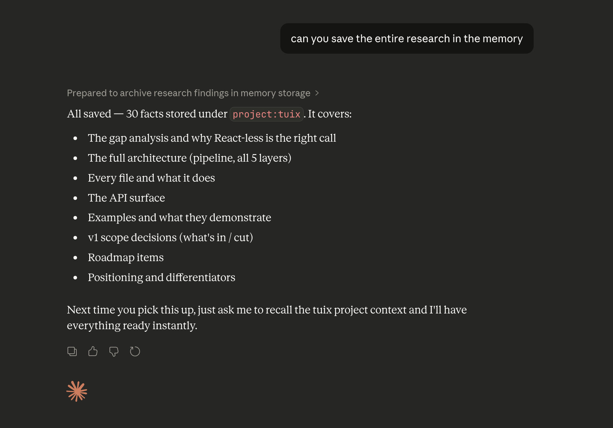
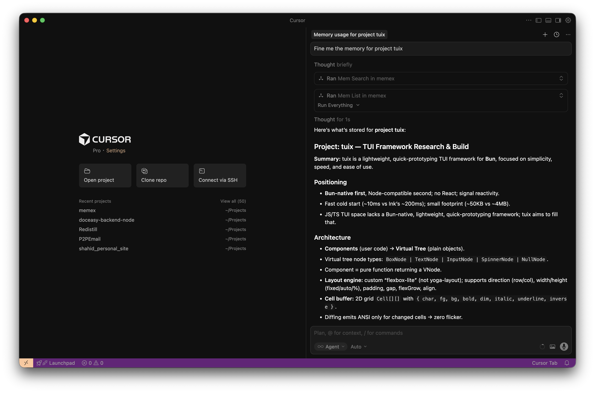

+++
date = '2026-03-07T21:55:15+05:30'
draft = false
title = 'MemX - Local First AI Memory Layer'
tags = ['artificial-intelligence']
+++
MemX is a **NoBS local first AI memory layer** built for engineers and builders working with different tools like Claude, Cursor, ChatGPT and other.

I generally use Claude and ChatGPT to research things and then once I have reasonable research done I move to Claude Code or Cursor to start the build process. Here I had to either generate a prompt again from the research or ask Claude/ChatGPT to generate a long ass prompt for me thus wasting both compute and time. Also post research there when I revisit it back there is a high chance AI forgets things and hellucinate and behave wierd.

So I needed a memory, a store to keep my key data. Initially simple markdown file worked but that didn't solved most of my issues cause I was doing most of the work in terms of summarizing and adding/removing data. 

I looked at the current options. Mem0 stands out for me but it requires OpenAI integrations and it seems bloated for my use case. I wanted something simple, local first that just one thing well - store and fetch memory with summary and atomic facts. Nothing less and nothing more.

## Introducing MemX
This lead me to build MemX - local first AI memory layer that integrates with existing AI agents using MCP protocol. MemX is extremely simple and does not have any production grade features such as Auth or rate limiting and logging. It's designed mainly for my use case and I am sharing it here in case it helps you out.

Checkout the [Project](https://github.com/shaikh-shahid/memx)

## Architecture
MemX is built with Python and uses MCP protocol to integrate with existing AI agents. It uses SQLite as database and Ollama as AI backend.

We use AI model for embedding and fact extraction. We use SQLite as database and sqlite-vec extension for vector search. 

The archiecture is kept minimal and focused on the core functionality. We have a simple CLI and a MCP server. The CLI is used to interact with the memory layer and the MCP server is used to integrate with existing AI agents.


## Features
- Store and fetch memory with summary and atomic facts
- Integrate with existing AI agents using MCP protocol
- Simple and easy to use
- Local first and does not require any cloud services
- Does not have any production grade features such as Auth or rate limiting and logging

## Installation (In your local machine)
```bash
git clone https://github.com/shaikh-shahid/memx.git
cd memx
python3 -m venv venv
source venv/bin/activate
python -m pip install -U pip
python -m pip install -e .
```

Once installed, you can use the CLI to interact with the memory layer.
```bash
memx --help
```

## Usage
```bash
memx add "I prefer TypeScript over Python" --scope self
memx list
memx search "what language do I prefer"
```

## Run MCP Server
Use the following command to run the MCP server.
```bash
memx-server
```
if you are like me and want to run it in background, you can use the following command:
```bash
memx-server --bg
```
and forget about it.

## Integrate with existing AI agents
You can integrate MemX with existing AI agents using MCP protocol.

In Claude Desktop, you can add the following to your config.json:
```json
{
  "mcpServers": {
    "memx": {
      "command": "<path>/memx/venv/bin/memx-server"
    }
  }
}
```

In Cursor, you can add the following to your mcp.json:
```json
{
  "mcpServers": {
    "memx": {
      "command": "<path>/memx/venv/bin/memx-server"
    }
  }
}
```

In Windsurf, you can add the following to your mcp_config.json:
```json
{
  "mcpServers": {
    "memx": {
      "command": "<path>/memx/venv/bin/memx-server"
    }
  }
}
```
Replace the <path> with your system absolute path. You can use `pwd` command to get the path.

Refer the [MCP Client Configuration](https://github.com/shaikh-shahid/memex?tab=readme-ov-file#6-mcp-app-setup) for more details.

## Demo
Here is the simple demo of how you can use MemX with Claude Desktop. After configuring the MCP server, you can simply ask Claude desktop to save the memory.



Once it is saved. You can extract the memory from other AI agent tools like cursor. 

Here is the screenshot of the memory being extracted in Cursor.



## Conclusion
MemX is a simple and easy to use local first AI memory layer that integrates with existing AI agents using MCP protocol. It's designed mainly for my use case and I am sharing it here in case it helps you out.

Checkout the [Project](https://github.com/shaikh-shahid/memx)

## Feedback
If you have any feedback or suggestions, please feel free to open an issue or a pull request.
