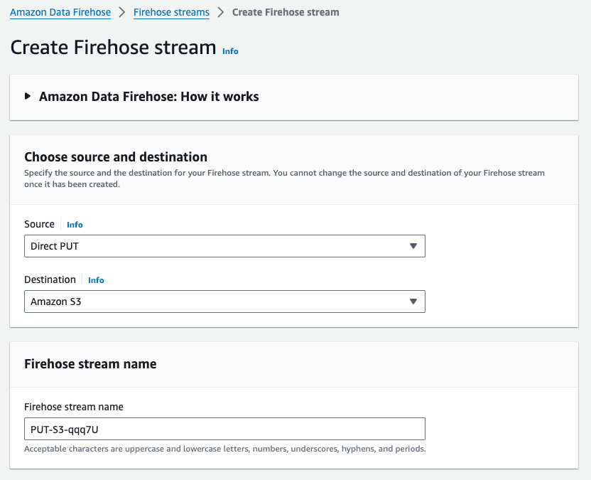
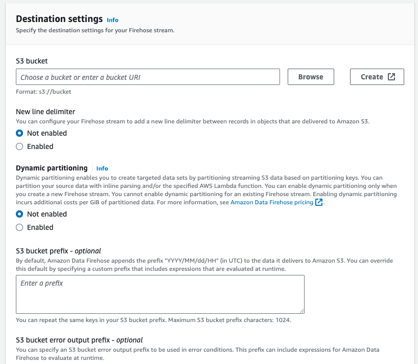
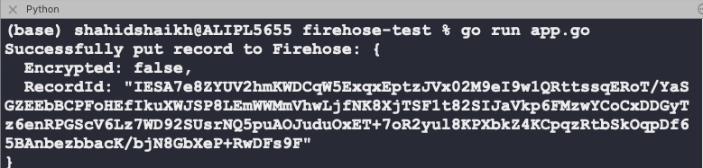

+++
date = '2024-06-12T11:55:34+05:30'
draft = false
title = 'Pushing Data to Amazon Kinesis Firehose Using Golang Sdk'
tags = ['aws','firehose']
aliases = ["/blog/pushing-data-to-amazon-kinesis-firehose-using-golang-sdk/293/"]
+++
The Kinesis Firehose is a managed AWS service and it allows us to push data in real-time and travel it to different destinations such as Datalakes, etc. In this quick tutorial, I am going to walk you through a sample code and we will create a Firehose steam and push data from our code to the stream and finally to the S3 bucket.

Get an AWS account if you don't have it already. Log in to the AWS console and search for "firehose".

Click on the "Create Firehose Stream" button and follow the prompt.



Select Source as "DirectPut". We will be pushing data from the code using this method.

Select Destination as Amazon S3 bucket.



Select an existing bucket or create one.

Scroll down and click on "Create Firehose Stream". This will take a couple of seconds and we should have our stream ready to use. Let's code it out.

## AWS Firehose Integration with GoLang

Create a new Go project using the following command.
```shell
    go mod init github.com/username/reponame
```
Install the following dependencies.
```shell
    go get -u github.com/aws/aws-sdk-go/aws
    go get -u github.com/aws/aws-sdk-go/aws/session
    go get -u github.com/aws/aws-sdk-go/service/firehose
```    

Grab your AWS credentials and put them in a file named **aws\_credentials**.**json** in this format.
```json
    {
        "access_key_id": "your_aws_access_key_id",
        "secret_access_key": "your_aws_secret_access_key",
        "region": "your_aws_region"
    }
```    

Copy this code in the **app.go** file.
```go
    package main
    
    import (
    	"encoding/json"
    	"fmt"
    	"io/ioutil"
    	"log"
    	"os"
    
    	"github.com/aws/aws-sdk-go/aws"
    	"github.com/aws/aws-sdk-go/aws/credentials"
    	"github.com/aws/aws-sdk-go/aws/session"
    	"github.com/aws/aws-sdk-go/service/firehose"
    )
    
    // AWSConfig stores the AWS credentials
    type AWSConfig struct {
    	AccessKeyID     string `json:"access_key_id"`
    	SecretAccessKey string `json:"secret_access_key"`
    	Region          string `json:"region"`
    }
    
    func main() {
    	// Read AWS credentials from a JSON file
    	awsConfig, err := readAWSConfig("aws_credentials.json")
    	if err != nil {
    		log.Fatalf("Failed to read AWS credentials: %v", err)
    	}
    
    	// Create a new AWS session
    	sess, err := session.NewSession(&aws.Config{
    		Region:      aws.String(awsConfig.Region),
    		Credentials: credentials.NewStaticCredentials(awsConfig.AccessKeyID, awsConfig.SecretAccessKey, ""),
    	})
    	if err != nil {
    		log.Fatalf("Failed to create AWS session: %v", err)
    	}
    
    	// Create a new Firehose client
    	firehoseClient := firehose.New(sess)
    
    	// Sample JSON data
    	data := map[string]string{
    		"data": "100000",
    		"val":  "20",
    	}
    
    	// Convert data to JSON
    	jsonData, err := json.Marshal(data)
    	if err != nil {
    		log.Fatalf("Failed to marshal JSON data: %v", err)
    	}
    
    	// Push the JSON data to Firehose
    	deliveryStreamName := "PUT-S3-ql0D4"
    	input := &firehose.PutRecordInput{
    		DeliveryStreamName: aws.String(deliveryStreamName),
    		Record: &firehose.Record{
    			Data: append(jsonData, '\n'), // Firehose expects newline-delimited JSON
    		},
    	}
    
    	result, err := firehoseClient.PutRecord(input)
    	if err != nil {
    		log.Fatalf("Failed to put record to Firehose: %v", err)
    	}
    
    	fmt.Printf("Successfully put record to Firehose: %v\n", result)
    }
    
    // readAWSConfig reads the AWS credentials from a JSON file
    func readAWSConfig(filename string) (*AWSConfig, error) {
    	file, err := os.Open(filename)
    	if err != nil {
    		return nil, fmt.Errorf("failed to open AWS credentials file: %w", err)
    	}
    	defer file.Close()
    
    	bytes, err := ioutil.ReadAll(file)
    	if err != nil {
    		return nil, fmt.Errorf("failed to read AWS credentials file: %w", err)
    	}
    
    	var config AWSConfig
    	if err := json.Unmarshal(bytes, &config); err != nil {
    		return nil, fmt.Errorf("failed to unmarshal AWS credentials JSON: %w", err)
    	}
    
    	return &config, nil
    }
```    

Run the code using the following command.
```shell
    go run app.go
```
You should see output like this.



Now head over to the AWS S3 bucket and you should see the folder with the year/month/date format. Navigate it to see the data.

You can modify how you want to name the files and prefixes in the configuration of streams.

Learn more about AWS Firehose from this [documentation](https://aws.amazon.com/firehose/).
