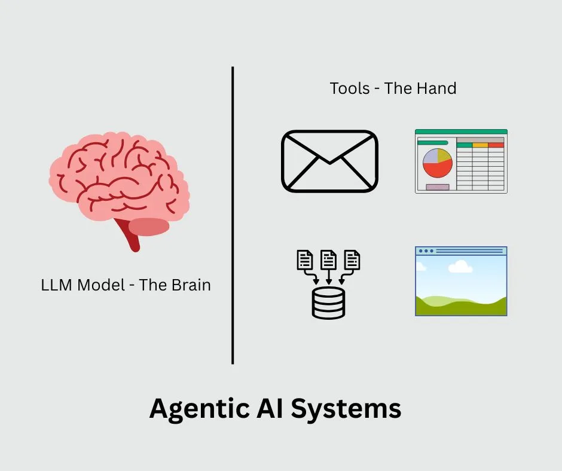

+++
date = '2025-08-08T11:55:00+05:30'
draft = false
title = 'What the Heck Is Agentic Ai Anyway'
tags = ['artificial-intelligence','agents']
aliases = ["/blog/what-the-heck-is-agentic-ai-anyway/400/"]
+++
## The Simple Answer

...There is no simple answer.

Here's the 10,000x scoped-out bird's-eye view for you.

> Regular AI talks to you. Agentic AI does things for you.

Remember when ChatGPT first blew everyone's minds in 2022? It could have conversations, answer questions, and write pretty much anything you asked for. That was amazing, but it had one big limitation — it could only talk. It couldn't actually _do_ anything in the real world.

Agentic AI changes that. Instead of just chatting with you, it can take real actions, such as sending emails, booking meetings, updating spreadsheets, or even ordering your lunch.

- **Regular AI** is like having a consultant who can give you amazing advice but has no arms or legs. They can tell you exactly what to do, but you still have to do it yourself.
    
- **Agentic AI** is like giving that same consultant hands and feet like Robots. Now they can actually help you get stuff done, not just talk about it.
    

## The Brain and Hands Analogy

Here's my favourite way to draw a picture of Agentic AI in a nutshell.

Think of the AI model (like GPT or Claude) as the **brain**, and all the tools it can use as the **hands**.

Without hands, the brain can think and talk all day, but it can't pick up a cup of tea, write an e-mail or this blog post. Give it hands, and suddenly it can interact with the world around it.

That's exactly what happened with AI. We gave our smart AI "hands" in the form of tools — ways to connect to email systems, databases, calendars, and other software.

## What Makes an AI Agent Actually Agentic

So an AI using tools mean agentic? Not exactly. I know I am confusing it again, but allow me to explain. The agentic AI have a few extra features or powers that make them stand out from existing AI systems. The essentials of those powers are:

*   **Memory**: Agentic AI systems remember what happened earlier in the conversation or previous tasks, so they don't start from scratch every time.
*   **Planning**: Agentic AI systems excel in breaking down complex tasks into steps. Instead of just doing one thing, they can think "First I'll do A, then B, then C."
*   **State management**: This is a fancy way of saying they keep track of what they're doing so they don't get confused or stuck in loops.

If an AI system possesses these powers, then they do qualify as an Agentic system. However, this is a rapidly changing field, and we may see some changes in the near future. But at least for now, they need to have these powers to become an agentic system.

## The Reality Check

Most, if not all, of today's "AI agents" are actually just AI models wrapped up in some clever workflows. The real intelligence still comes from the AI model itself — we've just gotten better at connecting it to other systems.

A couple of weeks back, I shared a similar thought on my LinkedIn page, and this got traction. This hurts lots of people, though, but it is what it is.

### Should You Care About Agentic AI

One world answer, you should! 

However, don't get caught up in the buzzwords, and new ones are coming almost every day. Instead, ask yourself this - 

_**"What repetitive, annoying tasks am I doing that I wish someone else could handle?"**_

And trust me, there are a lot of them. And that someone else can be your next AI Agent.

Some examples:

*   Scheduling meetings back and forth over email.
*   Updating spreadsheets with data from different sources.
*   Following up on customer support tickets.
*   Creating reports by pulling data from various systems.

If you can identify real pain points like these, then agentic AI might be worth exploring. But don't start with "I want to build an AI agent!" Start with "I want to solve this specific problem."

## Conclusion

Agentic AI is really just the next logical step in making AI more useful. Instead of having a conversation partner, you get a digital assistant that can actually assist with real work.

Is it revolutionary? In some ways, yes. Is it as complicated as all the technical jargon makes it sound? Not really.

At the end of the day, it's just AI that can finally roll up its sleeves and help you get things done. And honestly, it's about time.
